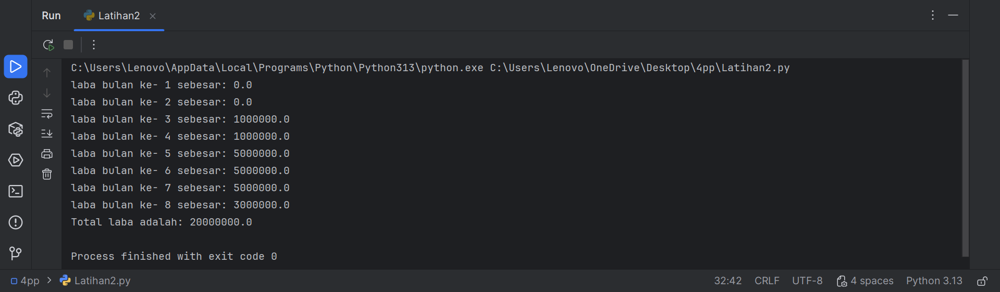

# labpy03
---
## Latihan 2
menghitung total keuntungan selama 8 bulan investasi

## Code Python (Latihan2.py)
```Python
MODAL_AWAL = 100_000_000.0  # 100 Juta
total_laba = 0.0

for bulan in range(1, 9):
    if bulan <= 2:
        # Bulan 1 dan 2: Laba 0%
        persentase_laba = 0.0
    elif bulan <= 4:
        # Bulan 3 dan 4: Laba 1%
        persentase_laba = 0.01  # 1%
    elif bulan <= 7:
        # Bulan 5, 6, dan 7: Laba meningkat 5%
        persentase_laba = 0.05  # 5%
    else:  # bulan == 8
        # Bulan 8: Penurunan 2% (sehingga laba menjadi 3%)
        persentase_laba = 0.03  # 3%

    laba_bulan_ini = MODAL_AWAL * persentase_laba

    total_laba += laba_bulan_ini

    print(f"laba bulan ke- {bulan} sebesar: {laba_bulan_ini}")

print(f"Total laba adalah: {total_laba}")
```
## Penjelasan Code
A. Struktur Perhitungan
- Program harus melakukan perhitungan secara berulang (iteratif) dari bulan 1 hingga bulan 8. Logika yang digunakan adalah:
    - $$\text{Laba Bulanan} = \text{Modal Awal} \times \text{Persentase Laba Bulan Terkait}$$
- Setiap laba bulanan kemudian diakumulasikan (dijumlahkan) untuk mendapatkan total laba.

B. Skema Persentase Laba
Persentase laba ditentukan oleh bulan keberapa perhitungan dilakukan:
1. Bulan ke-1 dan ke-2: Laba adalah 0%.
2. Bulan ke-3 dan ke-4: Laba adalah 1% dari modal awal.
3. Bulan ke-5, ke-6, dan ke-7: Laba adalah 5% dari modal awal.
4. Bulan ke-8: Laba adalah 3% dari modal awal (berdasarkan teks, laba bulan sebelumnya (5%) dikurangi 2%, menjadi 3%).

C. Kebutuhan Pemrograman
Untuk menyelesaikan latihan ini, program harus menggunakan dua elemen kontrol utama:
1. Loop (Perulangan): Digunakan untuk mengulang proses perhitungan laba dari bulan 1 hingga 8.
2. Kondisional: Digunakan untuk memeriksa nilai bulan (misalnya, if bulan == 1 atau elif bulan <= 4) untuk menerapkan persentase laba yang benar pada perhitungan.

D. Hasil Akhir yang Diharapkan
Output program harus menampilkan laba yang diperoleh untuk setiap bulan secara terpisah, dan diakhiri dengan tampilan total laba akumulasi setelah semua 8 bulan selesai dihitung.
  - Contoh Perhitungan Laba:
      - Laba Bulan 4 (1%): $100.000.000 \times 0.01 = \text{Rp } 1.000.000$
      - Laba Bulan 6 (5%): $100.000.000 \times 0.05 = \text{Rp } 5.000.000$
  - Catatan: Jika mengikuti semua persentase yang disebutkan (termasuk 3% di bulan 8), Total Laba seharusnya adalah Rp 20.000.000.
## Otput

