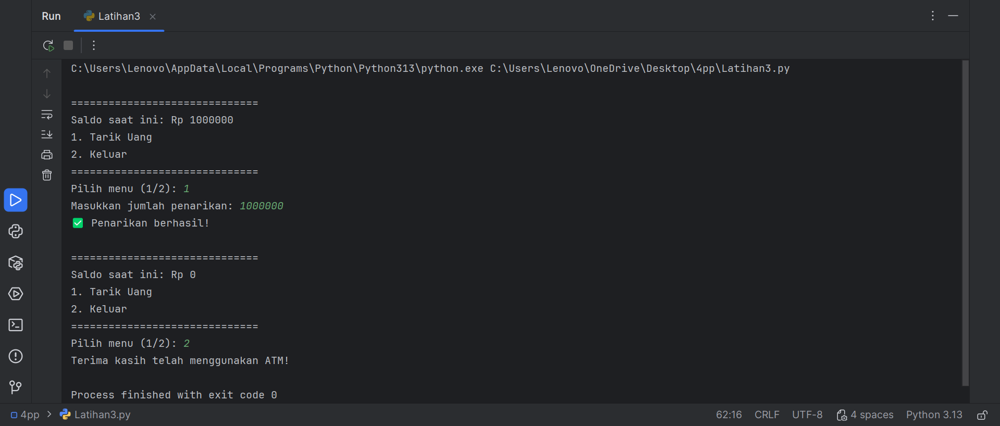

# labpy03
---
# Latihan 3
Tujuan pemerograman ini untuk membuat Simulasi Mesin ATM Sederhana (atau Simple ATM Machine Simulation)
## Code Python (Latihan3.py)
```python
saldo = 1000000

def tampilkan_menu(current_saldo):
    print("\n" + "="*30)
    print(f"Saldo saat ini: Rp {current_saldo}")
    print("1. Tarik Uang")
    print("2. Keluar")
    print("="*30)

while True:
    tampilkan_menu(saldo)

    try:
        pilihan = input("Pilih menu (1/2): ")

        if pilihan == '1':
            jumlah_tarik_str = input("Masukkan jumlah penarikan: ")
            
            try:
                jumlah_tarik = int(jumlah_tarik_str)
            except ValueError:
                print("❌ Input tidak valid. Harap masukkan angka.")
                continue # Lanjut ke iterasi berikutnya
                
            if jumlah_tarik > saldo:
                print("⚠️ Saldo tidak mencukupi!")
            elif jumlah_tarik <= 0:
                print("❌ Jumlah penarikan harus lebih dari nol.")
            else:
                saldo -= jumlah_tarik
                print("✅ Penarikan berhasil!")
                
        elif pilihan == '2':
            print("Terima kasih telah menggunakan ATM!")
            break # Keluar dari perulangan
            
        else:
            print("❌ Pilihan tidak valid. Silakan pilih 1 atau 2.")
            
    except EOFError:
        print("\nProgram dihentikan.")
        break
    except Exception as e:
        print(f"Terjadi kesalahan: {e}")
        break

```
## Penjelasan Code
1. Inisialisasi Saldo Awal
  Variabel saldo diatur ke nilai awal 1000000 (Rp 1.000.000) sesuai dengan instruksi.

2. Perulangan Utama (while True)
  Program menggunakan perulangan tak terbatas (while True) untuk menampilkan menu dan memproses transaksi secara berulang. Ini akan terus berjalan sampai secara eksplisit   dihentikan.

3. Tampilan Menu
  Di awal setiap perulangan, program memanggil fungsi tampilkan_menu() yang menampilkan saldo saat ini dan dua pilihan menu:

  - Tarik Uang

  - Keluar

4. Pemilihan Menu
  Pengguna diminta untuk memasukkan pilihan (1 atau 2).

5. Logika Pilihan (if/elif/else)

  - A. Jika Pilih '1' (Tarik Uang):
    - Input Jumlah: Pengguna diminta memasukkan jumlah uang yang ingin ditarik.

    - Validasi Input: Program mencoba mengonversi input menjadi angka bulat (int). Jika gagal (misalnya, pengguna mengetik huruf), akan ada pesan error.

    - Cek Saldo:

        - Jika jumlah_tarik lebih besar dari saldo, program menampilkan pesan "Saldo tidak mencukupi!".

        - Jika jumlah_tarik kurang dari atau sama dengan nol, program menampilkan pesan error.

    - Penarikan Berhasil:

       - Jika semua validasi lolos, saldo diperbarui dengan operasi pengurangan (saldo -= jumlah_tarik).

       - Program menampilkan pesan "Penarikan berhasil!".

    -  Program kembali ke awal perulangan untuk menampilkan menu yang diperbarui.

  - B. Jika Pilih '2' (Keluar):
    - Program menampilkan pesan "Terima kasih telah menggunakan ATM!".

    - Perintah break dijalankan, yang menghentikan perulangan while True dan mengakhiri program.

  - C. Pilihan Lain:
    - Jika pengguna memasukkan input selain 1 atau 2, program menampilkan pesan "Pilihan tidak valid..." dan kembali ke awal perulangan.

6. Penanganan Error
 - Kode menggunakan blok try...except untuk mengantisipasi kesalahan input yang mungkin terjadi, seperti pengguna memasukkan teks saat program mengharapkan angka (saat     penarikan uang), sehingga program tidak langsung crash.
## Otput

